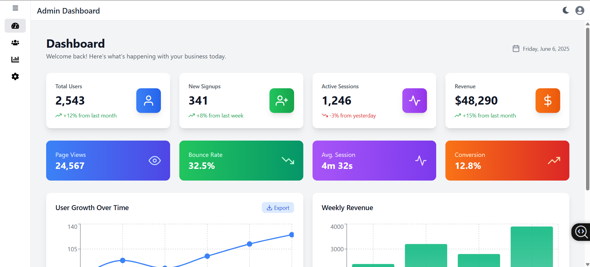
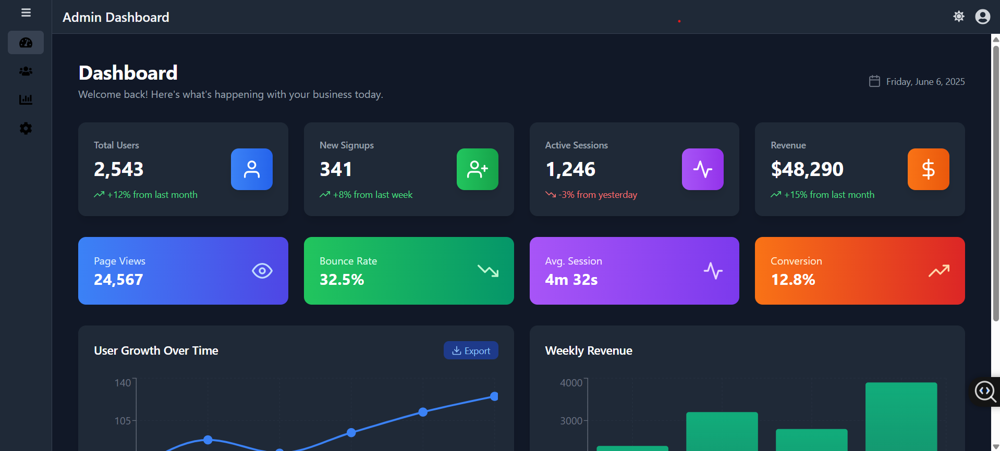
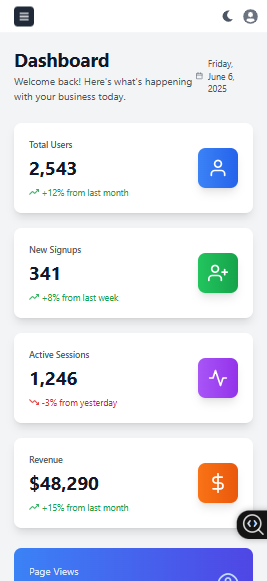

# Admin Dashboard - React & Tailwind CSS

A responsive admin dashboard application built with React and Tailwind CSS, featuring a collapsible sidebar, dark mode support, and multiple dynamic pages for managing users, reports, and settings.

## 📸 Screenshots

### Light Mode



### Dark Mode



### Mobile View



## ✨ Features

### 🎯 Core Features

- **Responsive Design** - Fully responsive layout that works on desktop, tablet, and mobile
- **Dark/Light Mode** - Toggle between dark and light themes with persistent preference
- **Collapsible Sidebar** - Sidebar collapses to icons on small screens and button click
- **Client-side Routing** - Smooth navigation between pages using React Router
- **Interactive Charts** - Dynamic data visualization using Recharts
- **Toast Notifications** - User-friendly notifications for actions

## 🛠️ Tech Stack

### Frontend

- **React 19** - Modern React with hooks and functional components
- **React Router DOM** - Client-side routing and navigation
- **Tailwind CSS** - Utility-first CSS framework for styling
- **React Hot Toast** - Toast notifications with theme support

### Data Visualization

- **Recharts** - React charting library for dashboard analytics

### Icons & UI

- **React Icons** - Comprehensive icon library (Feather Icons)

### Development Tools

- **Vite** - Fast build tool and development server
- **Prettier** - Code formatting

## 🚀 Getting Started

### Prerequisites

- Node.js (v14 or higher)
- npm or yarn package manager

### Installation

1. **Clone the repository**

   ```bash
   git clone https://github.com/yourusername/admin-dashboard.git
   cd admin-dashboard
   ```

2. **Install dependencies**

   ```bash
   npm install
   # or
   yarn install
   ```

3. **Start the development server**

   ```bash
   npm run dev
   # or
   yarn dev
   ```

4. **Open your browser**
   Navigate to `http://localhost:5173` to view the application

### Build for Production

```bash
npm run build
# or
yarn build
```

## 📋 Assignment Requirements Checklist

- ✅ Fixed sidebar with 4 menu options (Dashboard, Users, Reports, Settings)
- ✅ Top header with title, user profile icon, and dark mode toggle
- ✅ Collapsible sidebar (icons only in collapsed state)
- ✅ Client-side routing with React Router
- ✅ Dashboard with KPI cards and responsive charts
- ✅ Users page with table, search, and status filter
- ✅ Reports page with download functionality (toast notifications)
- ✅ Settings page with form validation
- ✅ Responsive design with mobile-first approach
- ✅ Dark/light mode support
- ✅ Reusable components (buttons, cards, table rows)
- ✅ Clean and modular folder structure
- ✅ Effective use of props, state, and events

## 👨‍💻 Author

**Priti Hazra**

- GitHub: pritih8(https://github.com/pritih8/)
- LinkedIn: https://www.linkedin.com/in/priti-h/
- Email: pritih8@gmail.com
